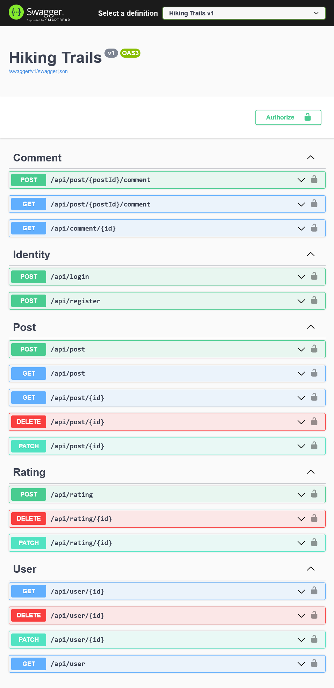

# About

Backend for a hiking trail social website. The frontend can be found [here](https://github.com/aksuram/hiking-trails-app).

# Project Setup

1. Setup a PostgreSQL database.

2. Edit _src\WebApi\appsettings.json_ file:

```json
{
  "Seeding": {
    "IsEnabled": true, //Enables seeding bogus data to database
    "Categories": ["Users"] //A list of different seedable data categories
  },
  "JwtSettings": {
    "Secret": "TO_BE_CHANGED_LATER" //Jwt secret - change to a random string
  },
  "ConnectionStrings": {
    "DefaultConnection": "Host=localhost;Database=hiking_trails;Username=postgres;Password=password;" ///PostgreSQL database connection string
  }
}
```

3. Run the program.

# API Endpoints


